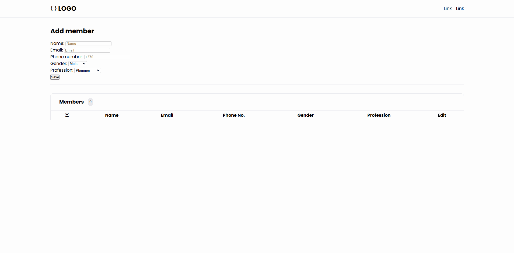

# Member Management System

## Overview

Member Management System is a web-based application designed to efficiently manage and organize contact information. This application provides a user-friendly interface for storing, editing, and managing personal and professional contacts. Built with vanilla JavaScript, HTML, and CSS, it demonstrates fundamental web development concepts and implements local storage for data persistence.

## Features

### Contact Management

- Add new contacts with detailed information including name, email, phone number, gender, and profession
- View all contacts in an organized table format
- Edit existing contact information through a modal interface
- Delete contacts with a single click
- Real-time contact counter displaying the total number of stored contacts

## Technologies Used

- **HTML5**: Structure and content
- **CSS3**: Styling and animations
- **JavaScript**: Core functionality and DOM manipulation
- **localStorage API**: Data persistence
- **Bootstrap Icons**: User interface icons
- **SVG Graphics**: Gender-specific user avatars

## Prerequisites

To run this application locally, follow these steps:

1. <code> git clone https://github.com/ElanasBartulis/Members-Table.git <code>
2. `Install Live Server Extension`
3. ` Use the Extension by pressing "Go Live" in the bottom right corner`

## Conclusion

This Member Management System represents one of my first significant JavaScript projects, serving as a valuable learning experience in web development. Through this project, I gained practical experience with various JavaScript concepts including:

- DOM manipulation
- Event handling
- Local storage management
- Modal implementations
- Dynamic HTML generation
- JavaScript modules and organization

The project helped me understand the importance of code organization, user interface design, and data persistence in web applications. While simple in concept, it implements many fundamental programming patterns and practices that are essential in modern web development.

## Demo

Here’s a small demo showing of this project :

